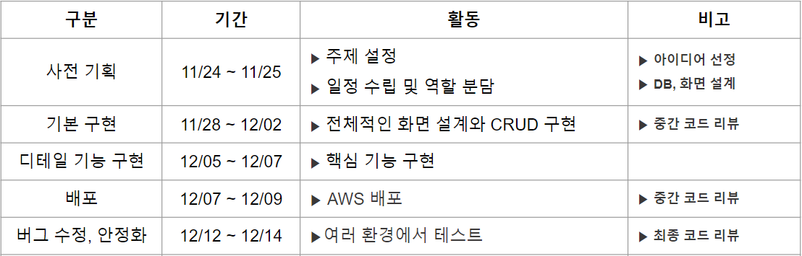
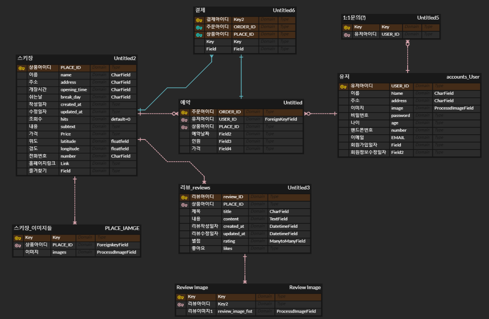
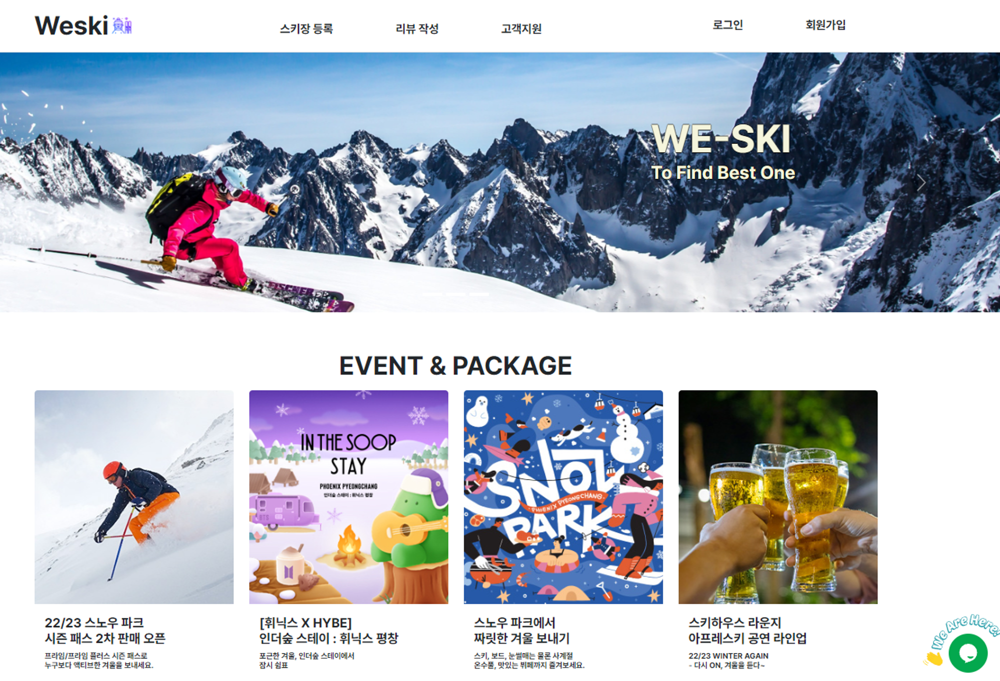
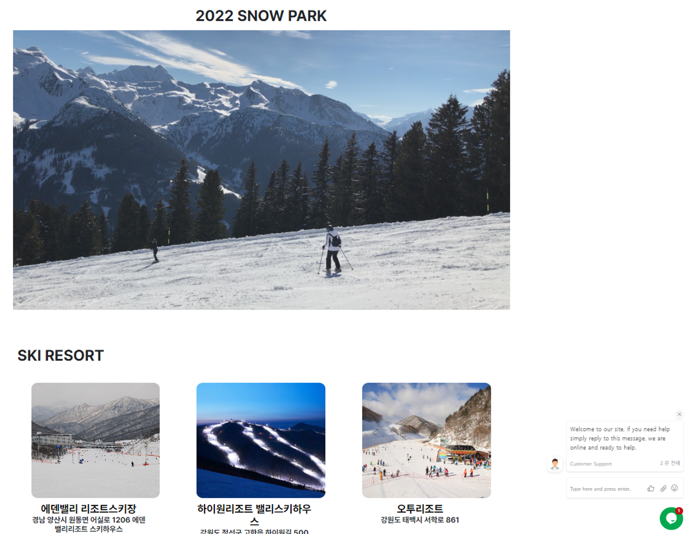
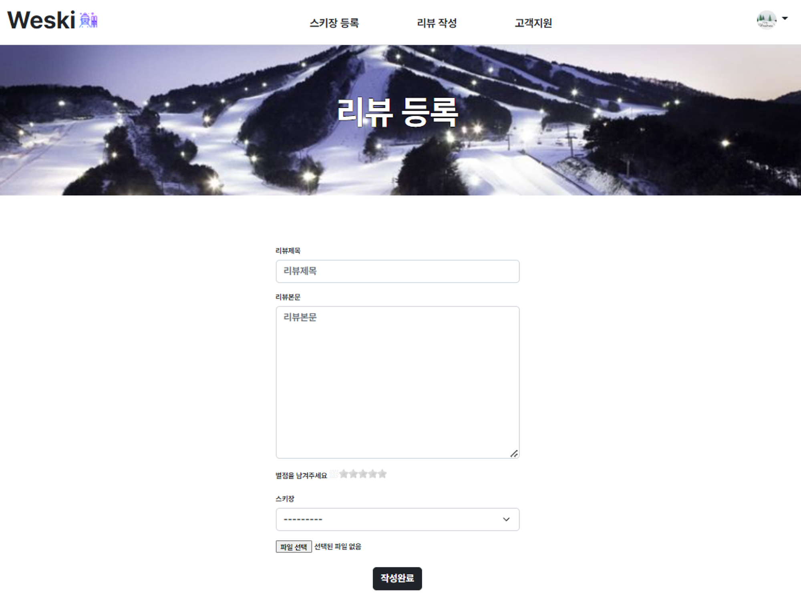
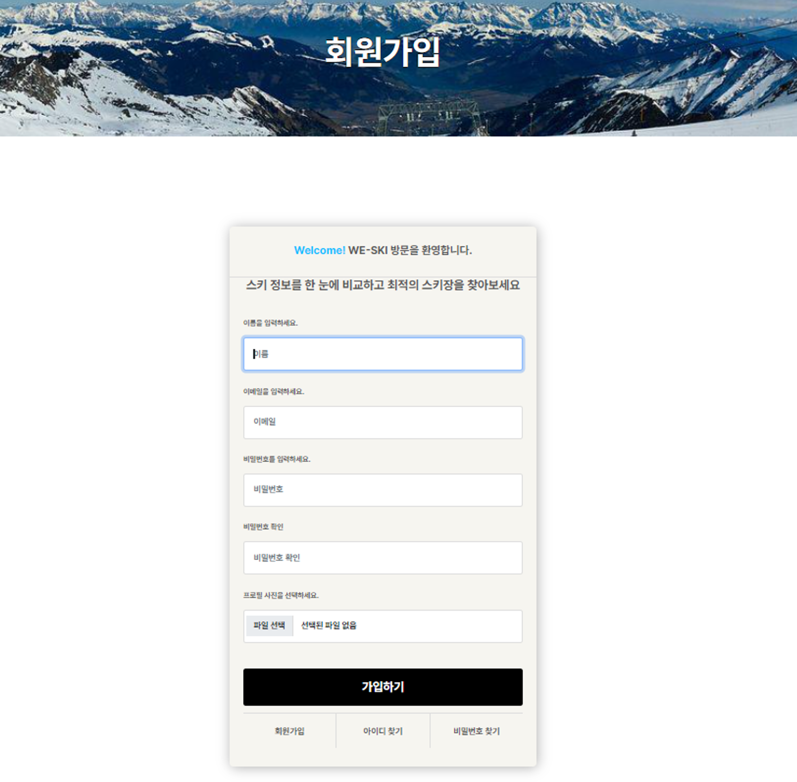
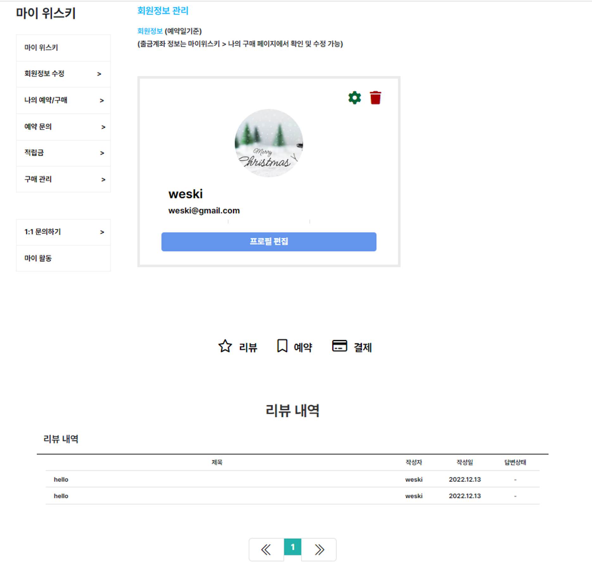

# WeSki
http://kdtweskibean-env.eba-e2ntnra2.ap-northeast-2.elasticbeanstalk.com/

## 프로젝트 개요

● 컨셉
  겨울 시즌에 인기 요소인 스키장에 대한 솔직한 후기 공유를 한눈에 볼 수 있도록 함 
  고객 사용과 편의에 초점을 맞춘 스키장 후기 공유 커뮤니티

● 주제 선정 배경 및 기획의도 
  스키장 이용 후기를 자유롭게 평가하고 비교하여 최적의 스키장을 찾을 수 있도록 함

● 프로젝트 구현 내용
1. Reviews App: 리뷰CRUD, 좋아요, 별 점
2. Places App: 스키장 CRUD, 카카오 Map
3. Accounts App:회원관리

● 훈련내용과의 관련성
Django 웹 프레임워크와 HTML/CSS/JavaScript를 사용한 커뮤니티 웹 플랫폼

## **프로젝트 팀 구성 및 역할**

| 이름   | 역할       | 담당 업무                                          |
| ------ | ---------- | -------------------------------------------------- |
| 김민찬 | 팀장       | Places(index), Places(detail) 프론트엔드           |
| 이동영 | 팀원       | 저장소 생성 및 세팅, 전체 App 검토 및 수정         |
| 최정아 | 팀원, 서기 | Accounts 앱 풀스택                                 |
| 강문자 | 팀원, 발표 | Places, Reviews, Accounts(mypage), Base 프론트엔드 |
| 전준영 | 팀원       | Reviews 앱 백엔드                                  |
| 송강섭 | 팀원       | Places 앱 풀스택, nav 프론트엔드                   |

## **프로젝트 수행 절차 및 방법**

### 핵심 기능

* Places
  스키장 정보, 스키장 정보 CRUD, 스키장 위치 카카오map 연동
* Reviews
  스키장 리뷰 카테고리, 후기 CRUD, 좋아요 기능
* Accounts
  회원가입, 로그인/로그아웃, 마이페이지, 회원정보 수정
* 배포
  ec2 에 오류가 있는 pull request를 rollback 하는 방법을 찾지못해 재배포를 진행함. 
* 1:1 실시간 상담
  실시간 채팅 상담 : 고객 문의를 실시간으로 받을 수 있는 채팅 상담 기능

<aside>
☃️ Places App

</aside>

- 스키장 정보 : 그리드 시스템과 카드를 사용하여 Event와 Package를 나열했습니다. 그리고 를 추가하여 스키영상을 index 페이지에 렌더링했습니다.
- 스키장 정보 CRUD : 스키장의 상호명, 주소, 설명, 사진 등을 작성하고 작성한 글을 읽을 수 있습니다. 그리고 글을 수정하고 삭제할 수 있는 기능을 추가했습니다.
- 스키장 위치 카카오map 연동 : 스키장에 대한 다양한 정보와 스키장의 위치정보 확인이 가능한 카카오 map 기능을 사용했습니다.

<aside>
☃️ Reviews App

</aside>

- 스키장 리뷰 카테고리 : 작성한 리뷰 목록을 렌더링했습니다.
- 후기 CRUD : 리뷰 제목, 본문, 별점, 스키장에 대하여 작성하고 작성한 후기를 읽을 수 있습니다. 또한, 후기를 수정하고 삭제할 수 있는 기능을 구현했습니다. 또한 다중 이미지를 업로드 할 수 있도록 했습니다.
- 후기 ‘좋아요’ 기능 : 작성한 후기에 좋아요 기능을 추가했습니다.

<aside>
☃️ Accounts App

</aside>

- 회원 가입 : SignupForm을 통해 회원의 이름, 이메일, 비밀번호, 프로필 사진을 입력하면 가입할 수 있는 기능을 구현했습니다.
- 로그인 : AuthenticationForm을 사용하여 사용자 이름과 비밀번호를 입력하면 로그인하고 로그아웃할 수 있는 기능을 추가했습니다.
- 마이페이지 : 특정 사용자의 프로필 이미지, 아이디, 이메일을 확인하고 리뷰내역을 화면에 렌더링하였습니다.
- 회원정보 수정 : ChangeUserForm을 통해 특정 사용자의 아이디와 이메일을 수정할 수 있는 기능입니다.
- 회원 탈퇴 : 특정 고객이 탈퇴할 수 있는 기능을 구현했습니다.

추가 기능 

- 실시간 채팅상담: 고객 문의를 실시간으로 받을 수 있는 채팅 상담 기능을 메인 페이지에 렌더링했습니다.
